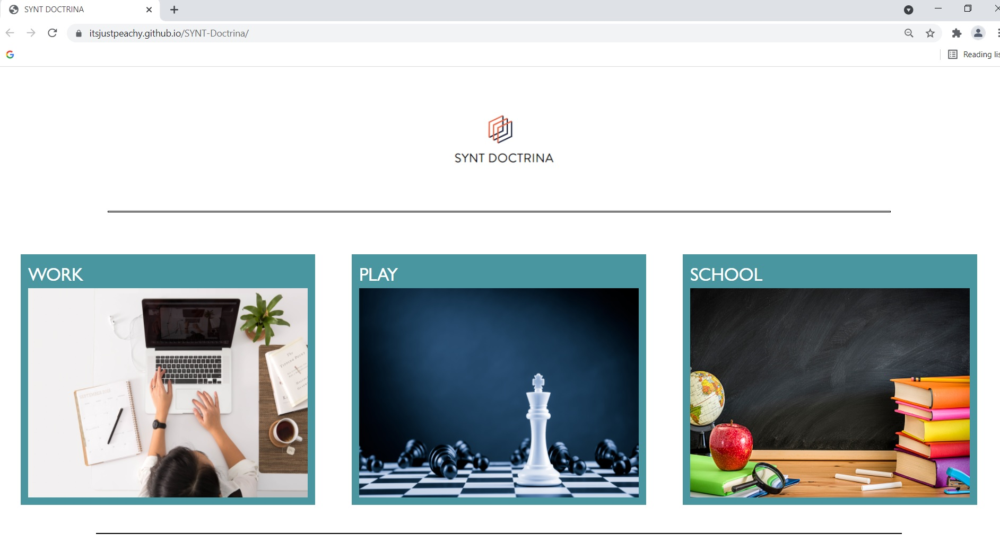

# SYNT Doctrina

A flexible webpage application that connects students with learning platforms based on their specifications

### Links

GitHub: https://github.com/itsjustpeachy/SYNT-Doctrina
Page: https://itsjustpeachy.github.io/SYNT-Doctrina/

 ### Technologies Libraries
 - [Rapid API - Learning Objects V2](https://rapidapi.com/inokufu-search-api/api/learning-objects-v2/details)
 - [Chicago Art API](https://api.artic.edu/docs/#quick-start)
 - [Jquery](https://jquery.com/)
 - [Bulma](https://bulma.io/documentation/)

## Functionality

This is a learning platform application, which works well based on Web API. When a user opens the application , the user is presented three different categories. These categories are as follows: WORK, PLAY, and, SCHOOL. By clicking and choosing one of these three categories, the user is lead to a subcategory that contains options offered to the user to narrow down the user’s search with more details. By clicking one of these, the user can see different courses based on the API’s search result. This is a simple but effective application that shows what API, JavaScript, CSS and HTML can achieve when they work
 together.
 
## Screenshot:

## License

MIT License

Copyright (c) 2021 Trevor Salada Santiago Ibarra Neda Parvini Yaquelin Amezcua

Permission is hereby granted, free of charge, to any person obtaining a copy
of this software and associated documentation files (the "Software"), to deal
in the Software without restriction, including without limitation the rights
to use, copy, modify, merge, publish, distribute, sublicense, and/or sell
copies of the Software, and to permit persons to whom the Software is
furnished to do so, subject to the following conditions:

The above copyright notice and this permission notice shall be included in all
copies or substantial portions of the Software.

THE SOFTWARE IS PROVIDED "AS IS", WITHOUT WARRANTY OF ANY KIND, EXPRESS OR
IMPLIED, INCLUDING BUT NOT LIMITED TO THE WARRANTIES OF MERCHANTABILITY,
FITNESS FOR A PARTICULAR PURPOSE AND NONINFRINGEMENT. IN NO EVENT SHALL THE
AUTHORS OR COPYRIGHT HOLDERS BE LIABLE FOR ANY CLAIM, DAMAGES OR OTHER
LIABILITY, WHETHER IN AN ACTION OF CONTRACT, TORT OR OTHERWISE, ARISING FROM,
OUT OF OR IN CONNECTION WITH THE SOFTWARE OR THE USE OR OTHER DEALINGS IN THE
SOFTWARE.
